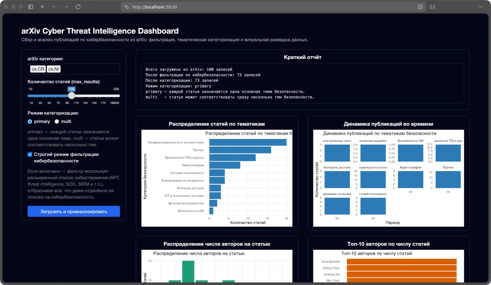
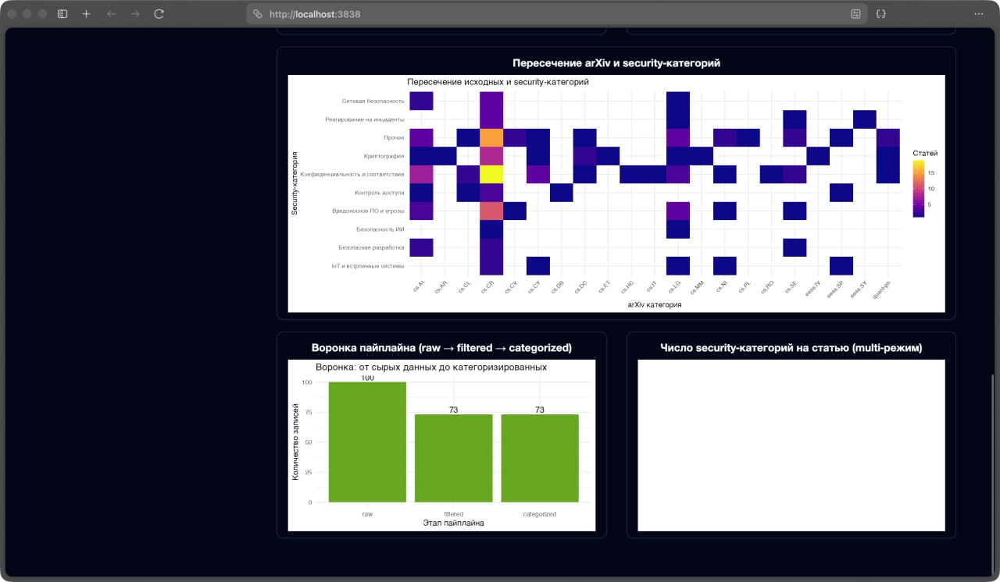

# Cyber Threat Intelligence Enrichment (Arxiv Collector)

Проект представляет собой R‑пакет для сбора, хранения и анализа научных публикаций из arxiv.org по темам информационной безопасности, threat intelligence и наступательной кибербезопасности. Цель — обогащение материалов киберразведки актуальными исследованиями и формирование тематического корпуса текстов.

## Инструкция по запуску
### Для запуска пакета необходимо:
1. Загрузить на устройсто актулаьный пакет
2. Выполнить команду 
```
docker run -p 3838:3838 <conainer-name>
```
> При необходимости используйте права суперадминистратора (sudo) для запуска контейнера

Где conainer-name - имя загруженного контейнера

3. Обратитесь в веб интерфейс по адресу http://127.0.0.1:3838/


## Основные компоненты

### 1. Сбор данных (`collect_data.R`)
- `fetch_arxiv_data()` - получение статей из arXiv API
- `filter_cybersecurity()` - фильтрация статей по темам безопасности
- `save_collected_data()` - сохранение собранных данных


### 2. Категоризация (`analysis_utils.R`)
- `categorize_articles()` - категоризация статей по 12 темам безопасности
- `get_category_stats()` - статистика по категориям
- Поддержка режимов: primary (одна категория) и multi (несколько категорий)

### 3. Хранение (`storage_utils.R`)
- `normalize_arxiv_records()` - нормализация в реляционную схему
- `save_to_parquet()` - сохранение в Parquet формат
- `init_duckdb_store()` - инициализация DuckDB базы данных

### 4. Визуализация (`visualization.R`)
- `plot_category_distribution()` - создает столбчатую диаграмму распределения статей по категориям безопасности
- `plot_publication_timeline()` - визуализирует динамику публикаций статей во времени
- `run_visual_dashboard()` -  запускает интерактивный веб-интерфейс для сбора, анализа и визуализации данных

### 5. Категории безопасности

1. Криптография
2. Сетевая безопасность
3. Вредоносное ПО и угрозы
4. Контроль доступа
5. Конфиденциальность и соответствие
6. Киберразведка
7. Веб-безопасность
8. IoT и встроенные системы
9. Безопасность ИИ
10. Блокчейн и криптовалюты
11. Реагирование на инциденты
12. Безопасная разработка

## Пример работы






## License
This project is licensed under the MIT License.
